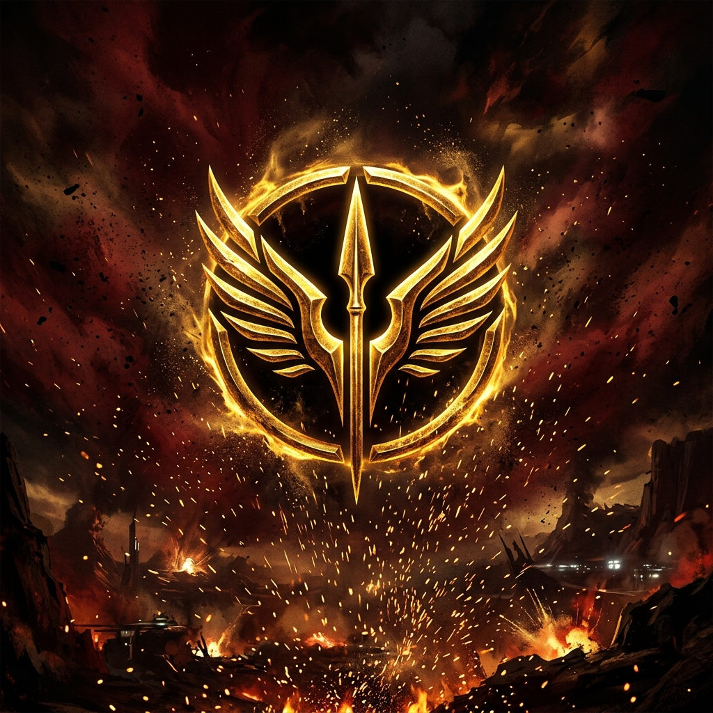

<div align="center">

# RED RISING SAGA

### Interactive Fan Experience

**An unofficial fan-made web experience inspired by Pierce Brown's _Red Rising_ universe — built as a frontend design and interaction showcase.**

<br />

[](https://redrisingsaga-fansite.vercel.app)

<br />

`INTERACTIVE WEB` · `FAN PROJECT` · `UI / UX` · `VANILLA JAVASCRIPT`

</div>

---



## About

This project is an **unofficial, non-commercial fan experience** inspired by the visual world, characters, books, and hierarchy of Pierce Brown's _Red Rising_ saga.

I built it as an experiment in turning a fictional universe into a polished digital interface rather than making a conventional book-list website.

The design leans into the series' visual contrast — **obsidian black, crimson, gold, hierarchy, war, and scale** — and combines it with interactive cards, motion, layered imagery, and a cinematic landing experience.

> This project is not affiliated with Pierce Brown, Del Rey, Penguin Random House, or any official _Red Rising_ rights holder.

---

## The Concept

The main idea was simple:

### What would a digital archive for the Society feel like?

Instead of treating the saga as a plain list of books, the site presents it as an interactive fan portal built around:

- characters and factions
- the Color hierarchy
- book-era navigation
- lore-focused presentation
- dramatic typography
- layered card interactions
- dark sci-fi visual direction

The result sits somewhere between:

### fan archive × interactive encyclopedia × frontend showcase

---

## Experience

### Cinematic Hero

The opening section establishes the site with a deep black and crimson palette, animated particles, large display typography, and depth-based interaction.

### Character Gallery

Major characters are presented through interactive cards with faction labels, imagery, short descriptions, and tilt-based motion.

### Saga Guide

The book section gives visitors a visual overview of the published saga and directs readers toward legitimate editions and official sources.

### Color Hierarchy

The Society's caste structure is represented visually as part of the site's world-building and information design.

### Responsive Interaction

The layout and controls are built to remain usable across desktop and smaller screens while preserving the site's dark, cinematic identity.

---

## Visual Direction

The interface uses a deliberately limited palette pulled from the series' imagery:

| Role | Color |
|---|---|
| Obsidian Background | `#080605` |
| Surface | `#120F0D` |
| Gold | `#C9A84C` |
| Light Gold | `#F3E098` |
| Crimson | `#B91C1C` |
| Cream | `#F7EBD3` |

Typography pairs **Cinzel** for the Roman / imperial display language with **Inter** for readable interface text.

---

## Interaction System

```text
POINTER / SCROLL
      ↓
TILT + DEPTH
      ↓
GLOW / SHADOW / MOTION
      ↓
CHARACTERS + LORE + BOOKS
      ↓
IMMERSIVE FAN EXPERIENCE
```

The site uses motion mainly to reinforce hierarchy and depth rather than filling every element with animation.

Interactive cards respond to pointer movement, navigation uses smooth scrolling, and the hero uses layered particles and perspective effects to establish atmosphere immediately.

---

## Tech Stack

<div align="center">


</div>

| Layer | Technology |
|---|---|
| Structure | HTML5 |
| Styling | CSS3 |
| Interaction | Vanilla JavaScript |
| Type Checking | TypeScript |
| Local Development / Tests | Python |
| Deployment | Vercel |

One reason I kept this project framework-light was to build the interaction and visual system directly with browser technologies instead of hiding everything behind a component library.

---

## Public Deployment

The live Vercel version is intentionally deployed as a **static fan edition**.

Its production configuration:

- blocks media playback through the public deployment
- disables payment capability
- excludes local audiobook and ebook files
- excludes development-only checkout/server code
- excludes credentials and local databases
- applies restrictive security headers and a Content Security Policy

The public project is therefore presented as a **reader-facing visual and interactive showcase**, not a source for copyrighted media.

---

## Local Development

Clone the repository:

```bash
git clone https://github.com/osaid829/redrisingsaga-fansite.git
cd redrisingsaga-fansite
```

Install the development dependency:

```bash
npm ci
```

Run checks:

```bash
npm run check
```

Start the local development server:

```bash
npm run dev
```

---

## Project Structure

```text
redrisingsaga-fansite/
├── index.html          # Main fan experience
├── style.css           # Visual system and responsive layout
├── script.js           # Interaction and UI behaviour
├── hero-bg.png         # Hero artwork
├── *.jpg / *.webp      # Character and book imagery
├── server.py           # Local development tooling
├── test_*.py           # Local tests
├── vercel.json         # Static deployment + security headers
└── README.md
```

---

## Why I Built It

This was one of my earlier projects for experimenting with how much personality I could give a website using relatively simple technologies.

There is no React component system or heavy frontend framework carrying the interface. Most of the visual identity comes from **CSS, JavaScript, layout, typography, imagery, hover behaviour, and motion**.

It also gave me a chance to build around something I already enjoyed rather than inventing another generic SaaS dashboard or landing page.

---

## Live Experience

<div align="center">

### [→ Explore the Red Rising Fan Experience](https://redrisingsaga-fansite.vercel.app)

</div>

---

## Rights & Disclaimer

_Red Rising_, its characters, book titles, world, and related intellectual property belong to **Pierce Brown and their respective rights holders**.

This repository is an **unofficial personal fan project** created for learning, design exploration, and portfolio demonstration.

No affiliation or endorsement is implied.

For the books and official information, visit Pierce Brown's official channels and authorised booksellers.

---

<div align="center">

### RED RISING SAGA

**Fan-made. Interactive. Built for the worlds I enjoy reading.**

<br />

[Live Experience](https://redrisingsaga-fansite.vercel.app) ·
[GitHub Profile](https://github.com/osaid829)

<br /><br />

Built by **Osaid**

</div>
